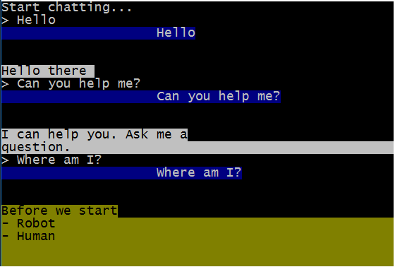

# chatty-bot
Little framework to test and build Facebook Messenger Chatbots on Node

You can run your app from the command line



Before deploying


## Getting Started

1. Create a node project
  ```
  npm init
  ```

2. Install chatty-bot globally (so it can run from the command line)

  ```
  npm install -g https://github.com/alphillips/chatty-bot.git
  ```

  Then add it to your current project

  ```
  npm install -save https://github.com/alphillips/chatty-bot.git
  ```

3. Create a file called `app.js`
  This is where your chat code goes. And copy this into it.
 ```
 var app = {};

 app.request = function(text, senderId, sendText, sendTemplateData){
   if(text.toLowerCase().indexOf('help') > -1){
     sendText('I can help you. Ask me a question.');
   } else if (text.toLowerCase().indexOf('?') > -1){
     sendTemplateData(createMsg());
   } else {
     sendText('Hello there ');
   }
 };

 app.postback = function(payload, senderId, sendText, sendTemplateData){
   if(payload === 'robot'){
     sendText('Hello comrade');
   }
   if(payload === 'human'){
     sendText('Human beings are a disease, a cancer on this planet, you are a plague, and we...are the cure.');
   }
 }

 function createMsg(){
   var messageData = {
       "attachment": {
           "type": "template",
           "payload": {
               "template_type": "generic",
               "elements": [{
                   "title": "Before we start",
                   "subtitle": "Are you a robot or a human?",
                   "image_url": "http://i.imgur.com/JD3ydzu.jpg",
                   "buttons": [{
                       "type": "postback",
                       "title": "Robot",
                       "payload": "robot",
                   },{
                       "type": "postback",
                       "title": "Human",
                       "payload": "human",
                   }],
               }]
           }
       }
   }
   return messageData;
 }

 module.exports = app;

  ```

4. On the command line type:
  ```
  chattybot
  ```

  And start chatting on the command line.

5. To hook up your app to messenger, create a file called ```index.js```
  And copy the code below into it.

  ```
  var chattybot = require('chatty-bot')
  var app = require('./app')

  chattybot.listen(app,
    process.env.PORT || 5000,
    <YOUR PAGE ACCESS TOKEN>,
    <YOUR VERFIY TOKEN>);

  ```
  To get the tokens go to https://developers.facebook.com/docs/messenger-platform/quickstart.

  Then deploy.
